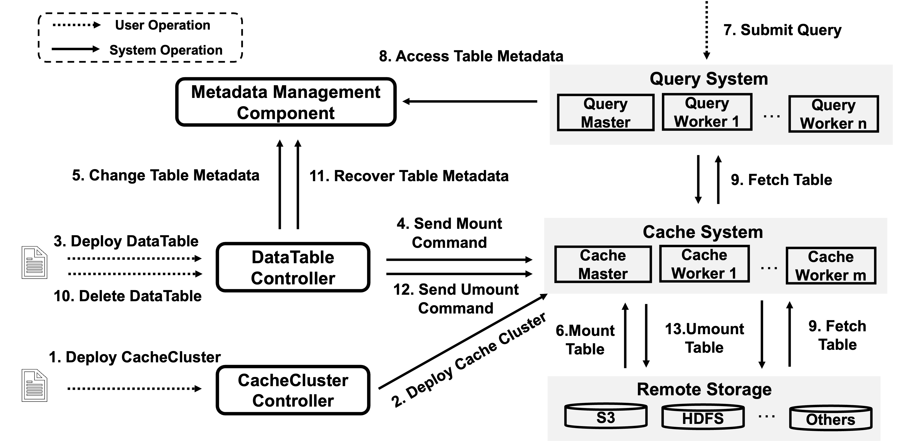

# Introducing Fluid-DataTable
## System Overview
 
Fluid-DataTable, a middleware tailored for big data query systems on cloud native platforms, enables efficient table caching access, adaptation, and task scheduling.
Leveraging the container orchestration platform, Kubernetes, we have implemented our Fluid-DataTable system.


In the figure above, the query, cache, and storage systems (highlighted in gray) represent existing third-party solutions. All other components, however, are developed as plugins, aiming for seamless integration within the existing Kubernetes ecosystem.
Moreover, barring the underlying storage system, all components operate in Pod mode.
In essence, this system comprises three main parts: User Interfaces, Core Components, and Others.

## System Workflow

Above figure illustrates the lifecycle of DataTable and its binding workflow with CacheCluster and Query.
The execution process of the Fluid-DataTable system primarily comprises two stages: preparation and querying.

### Preparation Phase
During the preparation phase, users specify their caching requirements through two custom resources: CacheCluster and DataTable.

After deploying a CacheCluster instance, the cachecluster controller initiates the cache system (such as Alluxio) within Kubernetes, based on the user-defined worker count and cache capacity.

Once the cache system is operational and the DataTable is deployed, the datatable controller mounts the data onto the cache system and updates the metadata location from the underlying storage system to the newly launched cache system.

### Querying Phase
In the querying phase, users deploy a big data query system (such as Presto).Through the Query custom resource, users specify query tasks to be executed.

These tasks are then prioritized by the query controller based on the cache status and then submitted to the big data query engine.

During the execution, the datatable controller utilizes the cache admission module to prioritize the mounting of high-value data based on calculated acceleration gain.

Additionally, the cache adaptation module dynamically adjusts the number of replicas and cache workers for the cached table data based on estimated access frequencies.

# Get Started With Fluid-DataTable
This document mainly describes how to deploy Fluid-DataTable with Helm, and use Fluid to create a datatable and speed up your query.

## Requirements  

1. Kubernetes 1.14+

    If you don't have a Kubernetes now, we highly recommend you use a cloud Kubernetes service. Usually, with a few steps, you can get your own Kubernetes Cluster. Here's some of the certified cloud Kubernetes services: 
    - [Amazon Elastic Kubernetes Service](https://aws.amazon.com/eks/)
    - [Google Kubernetes Engine](https://cloud.google.com/kubernetes-engine/)
    - [Azure Kubernetes Service](https://docs.microsoft.com/en-us/azure/aks/tutorial-kubernetes-deploy-cluster)
    - [Aliyun Container Service for Kubernetes](https://www.aliyun.com/product/kubernetes)

    > Note: While convenient, Minikube is not recommended to deploy Fluid due to its limited functionalities.

2. Kubectl 1.14+

    Please make sure your kubectl is properly configured to interact with your Kubernetes environment.

3. [Helm 3](https://helm.sh/docs/intro/install/)

    In the following steps, we'll deploy Fluid with Helm 3

## Deploy Fluid-DataTable
1. Create namespace for Fluid 
    ```shell
    $ kubectl create ns fluid-system
    ```  
2. Download the latest source code of Fluid from Github [main branch](https://github.com/nju-lands/Fluid-DataTable).

3. Deploy Fluid-DataTable with Helm
    ```shell
    $ helm install fluid charts/fluid/
    NAME: fluid
    LAST DEPLOYED: Tue Jul  7 11:22:07 2023
    NAMESPACE: default
    STATUS: deployed
    REVISION: 1
    TEST SUITE: None
    ```

4. Check running status of Fluid-DataTable
    ```shell
    $ kubectl get po -n fluid-system
    NAME                                         READY   STATUS    RESTARTS   AGE
    alluxioruntime-controller-64948b68c9-zzsx2   1/1     Running   0          108s
    csi-nodeplugin-fluid-2mfcr                   2/2     Running   0          108s
    csi-nodeplugin-fluid-l7lv6                   2/2     Running   0          108s
    dataset-controller-5465c4bbf9-5ds5p          1/1     Running   0          108s
    datatable-controller-6c8d9b6f54-qzd5n        1/1     Running   0          108s
    fluid-webhook-65fd4db9fd-57d7m               1/1     Running   0          108m
    ```

## Deploy Big Data Query System
There are many big data query systems on the market, and we cannot demonstrate them all here. So we use **Presto + Hive** as an example to demonstrate.

### Deploy Hive
1. Deploy a distributed storage system as the underlying storage for table data. Here we use HDFS, you can follow [this guide](https://hadoop.apache.org/docs/stable/hadoop-project-dist/hadoop-common/SingleCluster.html) or docker to deploy it.

2. Install Hive as the data warehouse. You can follow [this doc](https://cwiki.apache.org/confluence/display/hive/gettingstarted) or docker to install it.

3. Install MySQL and use it as a metastore for Hive. You can follow [this doc](https://data-flair.training/blogs/configure-hive-metastore-to-mysql/) to change the metastore.

4. Configure Hadoop for Hive. You need to change hive-env.sh to configure the path for local Hadoop.

5. Start the Hive.

### Deploy Presto
For ease of use, we have built images of the various components of Presto. You can directly deploy it on the K8s, but you can also choose other deployment methods.

```shell
# you need to change the <hive-url> in samples/datatable/source.yaml to the real hive url
$ kubectl apply -f samples/datatable
```

Now you can start a Presto client connecting to *http://presto-coordinator-service:8099* to execute your queries.


## Create a Datatable
Fluid provides cloud-native table acceleration and management capabilities, and uses *datatable* as a high-level abstraction to facilitate user management. Here we will show you how to create a datatable with Fluid. 

Firstly, create a Datatable object through the CRD file, which describes the source of tables. Then deploy it.  
```shell 
$ cat<<EOF >datatable.yaml
apiVersion: data.fluid.io/v1alpha1
kind: DataTable
metadata:
name: sample
spec:
url: <hive-url>
schemas:
    - schemaName: <schema-name>
    tables:
        - tableName: <table-name>

EOF
```  

```shell
$ kubectl apply -f datatable.yaml
```
- **Note**: This is a sample of datatable indicates that a table needs to be cached. And you need to replace \<hive-url\>, \<schema-name\> and \<table-name\> on your needs.
    
And we have omitted the step of creating a CacheRuntime because the controller will automatically create a public cache cluster when there is no CacheRuntime present in the cluster.

```shell 
$ kubectl get alluxioruntimes.data.fluid.io  
NAME               MASTER PHASE   WORKER PHASE   FUSE PHASE   AGE
datatable-common   Ready          Ready          Ready        145m
$ kubectl get pods                   
NAME                        READY   STATUS        RESTARTS         AGE
datatable-common-master-0   2/2     Running       0                145m
datatable-common-worker-0   2/2     Running       0                133m
datatable-common-worker-1   2/2     Running       0                133m
```

**Now, the tables you indicate in the datatable are cached in the cache cluster and the query engine will read them from cache rather than remote storage.**
